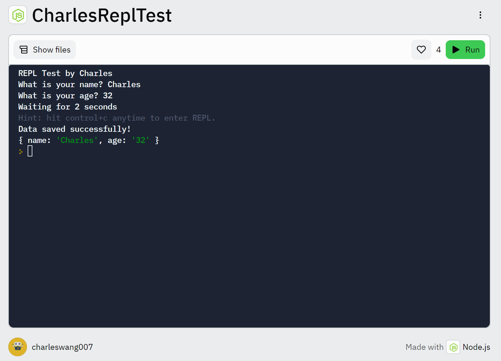

# Node.js

* Master Node.js nonblocking IO and async programming

* Handle more requests and increase your application's flexibility

* Use and write your own modules

* Perform common JSON/web server tasks

* Use browsers to generate pages on the fly via Ajax calls and template libraries

* Simplify development with the Express framework

* Create database back-ends using popular NoSQL and relational databases

* Deploy and run Node.js apps on Unix/macOS or Windows servers

* Deploy apps to Heroku and Microsoft Azure

* Support virtual hosts and SSL/HTTPS security

* Test Node.js programs that mix synchronous, async, and RESTful server API functionality

* Node.js runs single-threaded, non-blocking, asynchronous programming, which is very memory efficient.

## Node.js

* Callback (回呼): 一個回呼是指透過函數參數的參數傳遞到其他程式的，某段可執行程式的參考。

* 回呼函數的呼叫既可以是同步的 (如 map 方法)，也可以是非同步的 (如 setTimeout 方法中的匿名函數)。

* Asynchronous (非同步): Node 程式在發起一個呼叫後繼續向下執行，IO操作完成後，再執行對應的回呼函數 (非同步)。

* 雖然程式執行在單執行緒下，但依靠非同步+回呼的方式，也能實現對高平行處理的支援。

* Node.js is a JavaScript runtime built on Chrome's V8 JavaScript engine.

* Node.js uses an event-driven, non-blocking I/O model that makes it lightweight and efficient.

* Libuv 是一個跨平台的非同步 IO 庫，它結合了 UNIX 下的 libev 和 Windows 下的 IOCP 的特性，最早由 Node 的作者開發，專門為 Node 提供多平台下的非同步 IO 支援。Node 中的非阻塞 IO 及事件循環的底層機制，是是由 libuv 來實現的。

* 單執行緒支援高平行處理，通常都是依靠非同步 + 事件驅動 (循環) 來實現的，非同步使得程式在面臨多個請求時不會發生阻塞，事件循環提供了 IO 呼叫結束後呼叫回呼函數的能力。

* JavaScript 的事件循環是依靠瀏覽器實現的，而 Node 作為另一種執行時期，事件循環由底層的 libuv 實現。

* WebSocket 可以看作是 HTTP 協定的升級版，它同樣是以 TCP 協定為基礎的應用層協定，主要是為了彌補 HTTP 協定的無持久化和無狀態等缺陷而誕生的。WebSocket 提供了用戶端端和伺服器之間全雙工的通訊機制。

## MongoDB

* MongoDB 是由 C++ 語言撰寫的，是一個以分散式檔案儲存為基礎的開放原始碼資料庫系統。在高負載的情況下，增加更多的節點，可以確保伺服器效能。

* MongoDB 旨在為 Web 應用提供可擴充的高性能資料儲存解決方案。MongoDB 將資料儲存為一個文件，資料結構由鍵值 (key=>value) 隊組成。MongoDB 文件類似 JSON 物件。欄位值可以包含其他文件，陣列及文件陣列。

## Examples

```
var fs = require("fs");

var callback = function(err, data){
    if(err) return;
    console.log(data.toString());
}

fs.readFile("foo.txt", callback);
```

## npm vs. Yarn

* What is npm?

npm (short for Node Package Manager), initially released in 2010, is a tremendously popular package manager among JavaScript developers. It is the default package that is automatically installed whenever you install Node.js on your system. It consists of three components: the website to manage various aspects of your npm experience, Command Line Interface (CLI) to interact with npm via the terminal, and registry to access an extensive public database of JavaScript software. 

* What is Yarn?

Yarn, initially released by Facebook in 2016, is another popular package manager for the JavaScript programming language. The intention behind creating Yarn was to address some of the performance and security shortcomings of working with npm (at that time).

## Hello World Firebase Realtime Database in Node

[https://riptutorial.com/firebase/example/22139/hello-world-firebase-realtime-database-in-node](https://riptutorial.com/firebase/example/22139/hello-world-firebase-realtime-database-in-node)

## Node.js Async

# JavaScript Callbacks

1. JavaScript functions are executed in the sequence they are called. Not in the sequence they are defined.

2. A callback is a function passed as an argument to another function.

```
function myDisplayer(some) {
  document.getElementById("demo").innerHTML = some;
}

function myCalculator(num1, num2, myCallback) {
  let sum = num1 + num2;
  myCallback(sum);
}

myCalculator(5, 5, myDisplayer);
```

# Asynchronous JavaScript

1. In the real world, callbacks are most often used with asynchronous functions. A typical example is JavaScript setTimeout().

```
setTimeout(myFunction, 3000);

function myFunction() {
  document.getElementById("demo").innerHTML = "I love You !!";
}
```

2. When using the JavaScript function setInterval(), you can specify a callback function to be executed for each interval.

```
setInterval(myFunction, 1000);

function myFunction() {
  let d = new Date();
  document.getElementById("demo").innerHTML=
  d.getHours() + ":" +
  d.getMinutes() + ":" +
  d.getSeconds();
}
```

# JavaScript Promises

1. A JavaScript Promise object contains both the producing code and calls to the consuming code.

```
let myPromise = new Promise(function(myResolve, myReject) {
// "Producing Code" (May take some time)

  myResolve(); // when successful
  myReject();  // when error
});

// "Consuming Code" (Must wait for a fulfilled Promise)
myPromise.then(
  function(value) { /* code if successful */ },
  function(error) { /* code if some error */ }
);
```

2. Example using Callback

```
setTimeout(function() { myFunction("I love You !!!"); }, 3000);

function myFunction(value) {
  document.getElementById("demo").innerHTML = value;
}
```

3. Example using Promise

```
let myPromise = new Promise(function(myResolve, myReject) {
  setTimeout(function() { myResolve("I love You !!"); }, 3000);
});

myPromise.then(function(value) {
  document.getElementById("demo").innerHTML = value;
});
```

# JavaScript Async

1. The keyword async before a function makes the function return a promise

```
async function myFunction() {
  return "Hello";
}
myFunction().then(
  function(value) {myDisplayer(value);},
  function(error) {myDisplayer(error);}
);
```

2. The keyword await before a function makes the function wait for a promise:

```
let value = await promise;
```

3. The await keyword can only be used inside an async function.

```
async function myDisplay() {
  let myPromise = new Promise(function(resolve, reject) {
    resolve("I love You !!");
  });
  document.getElementById("demo").innerHTML = await myPromise;
}

myDisplay();
```

4. Waiting for a Timeout

```
async function myDisplay() {
  let myPromise = new Promise(function(resolve) {
    setTimeout(function() {resolve("I love You !!");}, 3000);
  });
  document.getElementById("demo").innerHTML = await myPromise;
}

myDisplay();
```

## REPL

Reference: [https://dev.to/irohitgaur/making-a-cli-app-in-repl-with-persistent-data-using-node-js-4bpo](https://dev.to/irohitgaur/making-a-cli-app-in-repl-with-persistent-data-using-node-js-4bpo)

My Work: [https://replit.com/@charleswang007/CharlesReplTest?v=1](https://replit.com/@charleswang007/CharlesReplTest?v=1)



## Socket.io

Socket.IO is a event-driven JavaScript library for real-time web applications. It enables real-time, bi-directional communication between web clients and servers. It has two parts: a client-side library that runs in the browser, and a server-side library for Node.js. Both components have a nearly identical API.

Socket.IO primarily uses the WebSocket protocol with polling as a fallback option, while providing the same interface. Although it can be used as simply a wrapper for WebSockets, it provides many more features, including broadcasting to multiple sockets, storing data associated with each client, and asynchronous I/O.

Socket.IO provides the ability to implement real-time analytics, binary streaming, instant messaging, and document collaboration. Notable users include Microsoft Office, Yammer, and Zendesk.

Socket.IO is not a WebSocket library with fallback options to other real-time protocols. It is a custom real-time transport protocol implementation on top of other real-time protocols. A Socket.IO implementing server cannot connect to a non-Socket.IO WebSocket client. A Socket.IO implementing client cannot talk to a non-Socket.IO WebSocket or Long Polling Comet server. Socket.IO requires using the Socket.IO libraries on both client and server side.

## Reference

[https://www.nodebeginner.org/index-zh-tw.html](https://www.nodebeginner.org/index-zh-tw.html)

[https://blog.hinablue.me/nodejs-first-look](https://blog.hinablue.me/nodejs-first-look)

[https://www.w3schools.com/nodejs/default.asp](https://www.w3schools.com/nodejs/default.asp)

[https://github.com/zcbenz/nw-sample-apps](https://github.com/zcbenz/nw-sample-apps)

[https://www.w3schools.com/nodejs/ref_modules.asp](https://www.w3schools.com/nodejs/ref_modules.asp)

[https://www.w3schools.com/js/js_callback.asp](https://www.w3schools.com/js/js_callback.asp)

[https://nodejs.dev/learn/modern-asynchronous-javascript-with-async-and-await](https://nodejs.dev/learn/modern-asynchronous-javascript-with-async-and-await)

[https://en.wikipedia.org/wiki/Socket.IO](https://en.wikipedia.org/wiki/Socket.IO)

[https://www.tutorialspoint.com/socket.io/index.htm](https://www.tutorialspoint.com/socket.io/index.htm)
